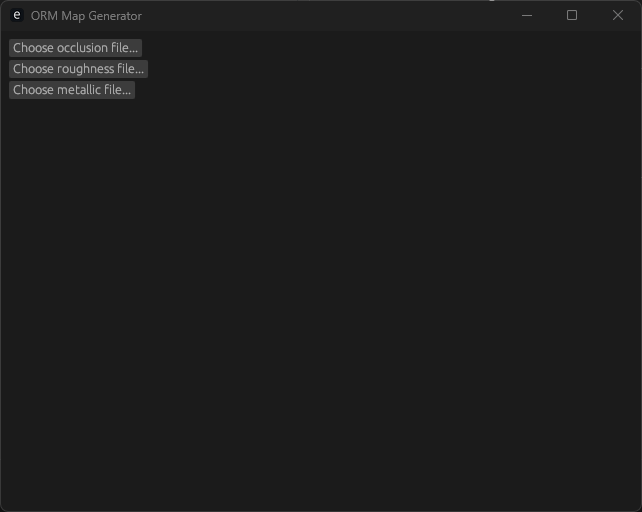

# ORM Generator

This is a simple tool to generate an [ORM Map](https://forum.reallusion.com/457280/What-does-the-ORM-Map-Do) from three other input textures.

- The **Red** channel of the first input texture (occlusion file) is **AO** value.
- The **Green** channel of the second input texture (roughness file) is **Roughness** value.
- The **Blue** Channel of the third input texture (metallic file) is **Metallic** value.

> Note: the three input textures should have same size.

And the generated ORM map has three color channels:
- **Red** channel: **AO**
- **Green** channel: **Roughness**
- **Blue** channel: **Metallic**

## Run

```shell
cargo run
```

## Usage
Run the execute and you will see the user interface or window like the snapshoot below:



For example, you choose the three input textures as below:
- Occlusion file:

- Roughness file:

- Metallic file:


And click the **Generate ORM Map** button:


You will get an image (ORM Map) like this one:


You can see the path of the generated file at **"Done. The generated ORM map: xxx"**.
